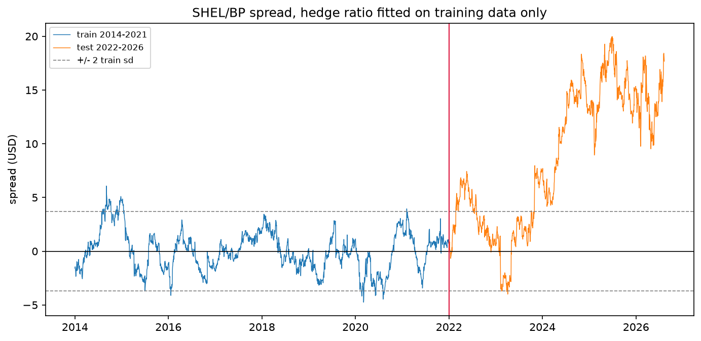
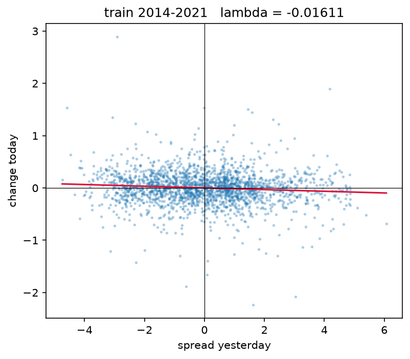
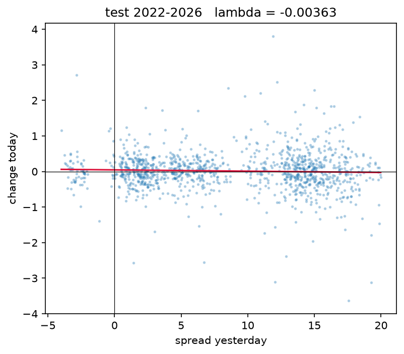

# Pairs Trading: Statistical Arbitrage on Energy Equities

Testing whether cointegration-based pairs trading survives out-of-sample on
liquid energy and industrial equities, with pre-registration and correction
for multiple testing.

**Status:** Phases 1-3 complete (data, screening, spread construction).
Signal generation and backtesting in progress.

---

## Headline result

Of seven pre-registered pairs, one showed evidence of cointegration at the
conventional 5% level. None survived correction for multiple testing. That
pair then failed completely out of sample, confirming the correction was
right to reject it.



Hedge ratio fitted on 2014-2021 and applied unchanged from 2022. The spread
oscillates around zero in training, then departs and stays away.

---

## Method

**Data.** Daily adjusted close from yfinance, 2014-2026, cached locally with a
frozen end date for reproducibility. Adjusted rather than raw close, since
ex-dividend steps would otherwise register as tradeable signals. Pairs aligned
individually so differing exchange calendars do not discard usable days.

**Split.** Train 2014-2021, test 2022-2026. Dates fixed before any testing.
The test set is used once.

**Screening.** Eight pairs pre-registered in `NOTES.md` with economic
rationale and committed to version control before any test was run, so the
commit history evidences that the hypotheses preceded the results. One pair
excluded on data grounds before p-values were calculated. Engle-Granger on the
remaining seven, training data only, with Bonferroni and Holm-Bonferroni
corrections.

**Spread.** OLS hedge ratio from training data, applied unchanged to test
prices. Half-life of mean reversion estimated from an Ornstein-Uhlenbeck fit
and used to derive the rolling window rather than choosing one arbitrarily.

---

## Screening results

Training period, 2014-2021.

| pair | coint stat | p-value | manual p | correlation | passes 0.05 | passes Holm |
|---|---|---|---|---|---|---|
| SHEL_BP | -3.6549 | 0.0209 | 0.0003 | 0.8890 | yes | no |
| NEE_DUK | -2.9768 | 0.1158 | 0.0029 | 0.7739 | no | no |
| ENPH_SEDG | -2.8757 | 0.1428 | 0.0039 | 0.4743 | no | no |
| MPC_VLO | -2.4520 | 0.3006 | 0.0137 | 0.8368 | no | no |
| SLB_HAL | -2.0042 | 0.5264 | 0.0431 | 0.8531 | no | no |
| XOM_CVX | -1.6422 | 0.7028 | 0.0950 | 0.8320 | no | no |
| VWS_NDX1 | -0.8099 | 0.9334 | 0.3664 | 0.5152 | no | no |

**Correlation and cointegration rank pairs differently.** ENPH/SEDG has the
lowest correlation (0.47) but the third-lowest p-value. XOM/CVX has 0.83
correlation and p = 0.70, a flat rejection. High correlation says two series
move together day to day; it says nothing about whether the gap between them
is bounded.

---

## Verifying the library

Engle-Granger was implemented from first principles in `cointegration.py` to
check what `coint()` does internally.

The regression matches `statsmodels` exactly (beta 1.687370, alpha -0.086446)
and the ADF statistics match `coint()` to four decimal places on all seven
pairs. The p-values do not, and the gap matters: under the manual lookup five
of seven pairs appear significant at 5% and three clear Bonferroni, against
one and none respectively under `coint()`. MPC/VLO moves from p = 0.30 to
p = 0.0137 on an identical statistic of -2.4520.

The cause is the critical value table. Critical values come from simulating a
procedure on data where the null is true. `adfuller` is benchmarked on
simulating one random walk and testing it directly, with no fitting involved.
`coint` is benchmarked on simulating two random walks, regressing one on the
other, and testing the residuals. The second procedure produces more negative
statistics even when the series are unrelated, because the regression finds
whatever combination happens to look most stationary, so its cutoff sits
further left.

`adfuller` receives only an array of residuals and cannot know that a hedge
ratio was estimated to minimise those exact numbers, so it applies the
no-fitting table. `coint` performs the regression itself and selects the
MacKinnon table matching the number of variables. Same experiment, different
benchmark.

---

## Out-of-sample failure

SHEL/BP was carried forward with the caveat that it does not survive
correction. Applying the training hedge ratio to test prices:

| | training 2014-2021 | test 2022-2026 |
|---|---|---|
| ADF statistic | -3.6549 | -0.1249 |
| p-value | 0.0003 | 0.6412 |
| mean | -0.0000 | 8.6560 |
| std | 1.8476 | 6.3704 |
| range | -4.75 to 6.07 | -4.00 to 19.97 |
| lambda | -0.01611 | -0.00363 |
| half-life | 43.0 days | not estimable |

The test spread averaged nearly five training standard deviations above zero
for four and a half years, with volatility more than tripled. Fitting a
constant to let the test find its own level barely improves the statistic
(-0.12 to -1.40), so this is a breakdown rather than a level shift: there is
no restoring force at zero and none at 8.66 either. Lambda is not
statistically distinguishable from zero, so no reversion timescale can be
estimated out of sample.




Change today against level yesterday. A downward slope is the restoring force.
Training shows a gentle tilt, barely visible against the noise, consistent
with lambda = -0.016 and with a p-value that failed Bonferroni. Test is flat,
and the horizontal axis extends to 20 against a training maximum of 6: the
spread is not oscillating in a familiar range with a weaker pull, it has left
the range entirely.

From 2022 the two firms diverged on strategy, with BP retreating from its
transition targets and restructuring while Shell took a different path on
capital allocation. The statistical break has an economic cause.

---

## Interpretation

The multiple-testing correction was not box-ticking. With seven tests at 5%,
the probability of at least one false positive is roughly 30%. A p-value of
0.0209 could not distinguish a real relationship from the best of seven draws,
and the test period showed it was the latter.

Cointegration among liquid, economically similar equity pairs appears rare
over an eight-year horizon, and relationships that hold in-sample can break
entirely in the following period. This is consistent with a market in which
persistent relative mispricings are largely arbitraged away, and with Gatev
et al. (2006) observing that raw returns to pairs trading declined sharply
once the strategy became widely known.

---

## Limitations

- Seven pairs is a small universe. A systematic screen across a full sector
  index would be a stronger test, at the cost of a much harsher multiple-testing
  burden where false discovery rate control would be more appropriate than
  Bonferroni.
- Adjusted close is a total return series, not a tradeable price. Fine for
  modelling a relationship, but the historical values could not have been
  transacted at.
- The hedge ratio is fixed from training and held constant, assuming a stable
  cointegrating relationship over twelve years. Kalman filtering would relax
  this and is a planned extension.
- Short borrow costs and market impact are not modelled.
- ADF has a relatively high Type I error rate, so borderline rejections
  warrant scepticism.

---

## Repository

```
data.py                 download, cache, align, train/test split
pair_screening.py       Engle-Granger across candidates, multiple-testing correction
cointegration.py        manual OLS and Engle-Granger implementation
spread_construction.py  spread, half-life, diagnostics, plots
NOTES.md                working record: decisions, reasoning, pre-registration
ROADMAP.md              phased build plan
results/                screening table and figures
```

## Running it

```
pip install -r requirements.txt
python data.py
python pair_screening.py
python spread_construction.py
```

Price data is downloaded on first run and cached to `data/`. Dataset frozen at
11 August 2026.

## References

Gatev, Goetzmann & Rouwenhorst (2006), *Pairs Trading: Performance of a
Relative-Value Arbitrage Rule*, Review of Financial Studies 19(3).
Engle & Granger (1987), *Co-integration and Error Correction*, Econometrica 55.
MacKinnon (1991, 2010), critical values for cointegration tests.
